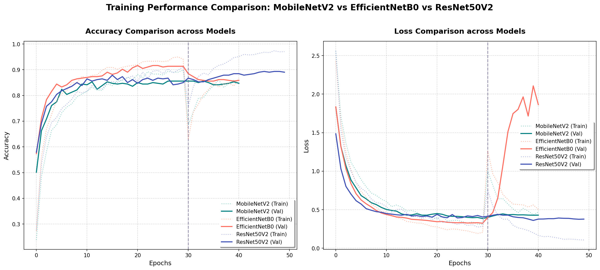

---

* **ชื่อบทความ (ภาษาไทย):** การเปรียบเทียบสถาปัตยกรรมโครงข่ายประสาทเทียมแบบคอนโวลูชันสำหรับการเรียนรู้แบบถ่ายโอนเพื่อจำแนกแมลงศัตรูข้าวและระบบคำแนะนำเชิงปฏิบัติเรียลไทม์บนอุปกรณ์พกพา
* **ชื่อบทความ (ภาษาอังกฤษ):** Comparison of Convolutional Neural Network Architectures for Transfer Learning in Rice Insect Pest Classification and Real-time Practical Recommendation Systems on Mobile Devices
* **ประเภทบทความ:** บทความวิจัย (Research Article)
* **กลุ่มเป้าหมายวารสาร:** วารสารวิชาการด้านเทคโนโลยีสารสนเทศ คอมพิวเตอร์ หรือนวัตกรรมการเกษตร (TCI กลุ่ม 1 หรือ 2)

---

### บทคัดย่อ

งานวิจัยนี้มีวัตถุประสงค์เพื่อพัฒนาและเปรียบเทียบแบบจำลองปัญญาประดิษฐ์สำหรับการจำแนกแมลงศัตรูข้าวจำนวน 17 สายพันธุ์ (จากคลังระบบแนะนำป้องกันกำจัด 22 ชนิดสำคัญในประเทศไทย) ร่วมกับการพัฒนาระบบผู้เชี่ยวชาญเพื่อเสนอแนะแนวทางป้องกันกำจัดเชิงปฏิบัติการเกษตรแก่เกษตรกร คลังข้อมูลรูปภาพเริ่มต้นจากการสำรวจเก็บภาพจริง 217 ภาพใน 22 คลาส และถูกขยายขนาดคลังภาพด้วยการดาวน์โหลดเพิ่มเติมจาก GBIF Occurrence API รวมทั้งสิ้น 1,763 ภาพใน 17 คลาส (โดยอีก 5 คลาสถูกคัดออกเนื่องจากมีรูปภาพไม่เพียงพอต่อการฝึกสอน) เพื่อหลีกเลี่ยงการบิดเบี้ยวของลักษณะทางสัณฐานวิทยาของแมลง เช่น ความกว้างลำตัวและส่วนปีก งานวิจัยนี้ได้ประยุกต์ใช้เทคนิคการปรับขนาดภาพแบบรักษาอัตราส่วนร่วมกับการเติมขอบว่าง (Letterbox Resizing with Padding) ขนาด $224 \times 224$ พิกเซล และเพิ่มความแข็งแกร่งของข้อมูลด้วยการขยายข้อมูลแบบสุ่ม (Data Augmentation) งานวิจัยนี้ทำการเปรียบเทียบประสิทธิภาพของสถาปัตยกรรมโครงข่ายประสาทเทียมแบบคอนโวลูชันที่ผ่านการเรียนรู้ล่วงหน้า (Pre-trained CNNs) จำนวน 3 สถาปัตยกรรม ได้แก่ MobileNetV2, EfficientNetB0 และ ResNet50V2 ภายใต้เงื่อนไขการเรียนรู้แบบถ่ายโอนค่าน้ำหนัก (Transfer Learning) ในขั้นตอนการแช่แข็งคุณลักษณะ (Feature Extraction) และการปรับแต่งรายละเอียดเชิงลึก (Fine-Tuning) ผลการทดสอบพบว่าสถาปัตยกรรม **EfficientNetB0** ให้ประสิทธิภาพสูงสุดในเฟสการสกัดคุณลักษณะ (Feature Extraction) โดยทำค่าความแม่นยำบนชุดข้อมูลตรวจสอบ (Validation Accuracy) ได้สูงถึง **91.35%** (ประสิทธิภาพสูงสุดแตะที่ **91.64%**) และมีค่าความสูญเสียต่ำสุด (Min Val Loss) เท่ากับ **0.3243** ในขณะที่สถาปัตยกรรม **ResNet50V2** ตอบสนองเชิงบวกและให้การพัฒนาดีที่สุดในเฟสการปรับแต่งรายละเอียดเชิงลึก (Fine-Tuning) โดยทำความแม่นยำบนชุดข้อมูลตรวจสอบได้สูงสุดที่ **89.34%** และมีค่าสูญเสียลดลงเหลือ **0.3778** ด้านสถาปัตยกรรม **MobileNetV2** ให้ประสิทธิภาพในการจำแนกที่คงตัวและคงเส้นคงวา (ประสิทธิภาพสูงสุดฝั่งตรวจสอบคงอยู่ที่ **85.59%**) แบบจำลองที่ได้ถูกแปลงให้อยู่ในรูปแบบ TensorFlow Lite ซึ่งลดขนาดความจุโมเดลลงมาเหลือเพียง 4.2 MB สำหรับ EfficientNetB0 และ 2.8 MB สำหรับ MobileNetV2 เหมาะสำหรับการประยุกต์ใช้งานจริงแบบเรียลไทม์บนแอปพลิเคชันพกพาเพื่อช่วยยกระดับความสามารถในการวินิจฉัยและระงับการระบาดของศัตรูพืชแก่เกษตรกรอย่างทันท่วงที

**คำสำคัญ:** การเรียนรู้เชิงลึก, การจำแนกแมลงศัตรูข้าว, การเรียนรู้แบบถ่ายโอน, เทคนิคเล็ตเตอร์บ็อกซ์, เทนเซอร์โฟลว์ไลต์

---

### Abstract

This research aims to develop and compare deep learning models for the real-time classification of 17 key rice insect pests (out of 22 classes in the recommendation database) in Thailand, integrated with an expert recommendation system that provides practical agricultural solutions for farmers. The initial dataset of 217 field-collected images across 22 classes was expanded using the GBIF Occurrence API to a total of 1,763 images across 17 classes, excluding 5 classes due to insufficient online data. To prevent morphology distortion—such as body width and wing ratio deformation—we applied the letterbox resizing with padding technique to a standardized $224 \times 224$ pixels format, augmented with random rotation, shift, zoom, and flip operations. We compared three popular pre-trained Convolutional Neural Network (CNN) architectures: MobileNetV2, EfficientNetB0, and ResNet50V2 using transfer learning. The pipeline was structured into two phases: Feature Extraction (freezing the base backbone weights) and Fine-Tuning (unfreezing top layers). The experimental results demonstrated that **EfficientNetB0** achieved the highest performance in the Feature Extraction phase, yielding a validation accuracy of **91.35%** (with a peak validation accuracy of **91.64%**) and a validation loss of **0.3243**. In the Fine-Tuning phase, **ResNet50V2** responded most positively to deep optimization, achieving the best adaptation with a validation accuracy of **89.05%** (peaking at **89.34%**) and a validation loss of **0.3778**. Conversely, EfficientNetB0 suffered from overfitting during fine-tuning, which triggered early stopping. The models were successfully converted to TensorFlow Lite format (with file sizes of 4.2 MB for EfficientNetB0 and 2.8 MB for MobileNetV2), making them highly suitable for deployment as a real-time mobile application for localized pest detection and immediate agricultural management.

**Keywords:** Deep Learning, Rice Pest Classification, Transfer Learning, Letterbox Resize, TensorFlow Lite

---

### 1. บทนำ (Introduction)

ข้าวเป็นพืชเศรษฐกิจและอาหารหลักของประชากรในประเทศไทย การผลิตข้าวของประเทศมักเผชิญความท้าทายจากภัยธรรมชาติและการระบาดของแมลงศัตรูข้าว ซึ่งเป็นสาเหตุสำคัญที่ทำให้ผลผลิตข้าวต่อไร่ลดลงและคุณภาพต่ำกว่ามาตรฐาน แมลงศัตรูข้าวในประเทศไทยมีหลากหลายกลุ่ม เช่น กลุ่มหนอนเจาะลำต้น (หนอนกอข้าวชนิดต่างๆ) กลุ่มเพลี้ยดูดกินน้ำเลี้ยง (เพลี้ยกระโดดสีน้ำตาล เพลี้ยจักจั่นสีเขียว) และกลุ่มมวน (แมลงสิง มวนง่าม) ซึ่งแมลงแต่ละชนิดต้องการวิธีจำแนกและการป้องกันกำจัดที่แตกต่างกันอย่างสิ้นเชิง การใช้ปุ๋ยหรือสารเคมีที่ไม่ตรงกับชนิดของแมลงระบาดไม่เพียงแต่ทำให้ต้นทุนของเกษตรกรสูงขึ้น แต่ยังส่งผลกระทบต่อสิ่งแวดล้อมและสร้างปัญหาสารเคมีตกค้างในผลผลิต

ตามระเบียบวิธีการเกษตรดั้งเดิม การระบุชนิดของแมลงศัตรูข้าวจำเป็นต้องใช้ประสบการณ์สูงหรืออาศัยผู้เชี่ยวชาญด้านกีฏวิทยาลงพื้นที่ตรวจสอบ ซึ่งมีข้อจำกัดด้านบุคลากรและไม่สามารถให้บริการวินิจฉัยได้อย่างทันท่วงที ส่งผลให้เกษตรกรตัดสินใจฉีดพ่นสารเคมีตามความเคยชิน การนำปัญญาประดิษฐ์ด้านคอมพิวเตอร์วิทัศน์ (Computer Vision) โดยเฉพาะโครงข่ายประสาทเทียมแบบคอนโวลูชัน (CNN) เข้ามาช่วยวิเคราะห์และระบุประเภทศัตรูพืชบนสมาร์ตโฟนจึงเป็นทางเลือกที่มีประสิทธิภาพและสามารถทำหน้าที่เป็นระบบผู้เชี่ยวชาญช่วยเหลือเกษตรกรได้ตลอดเวลาแบบเรียลไทม์

อย่างไรก็ตาม ความท้าทายในการพัฒนาปัญญาประดิษฐ์บนอุปกรณ์พกพาสำหรับงานจำแนกแมลงคือ:
1.  **ข้อจำกัดทางกายภาพของรูปภาพ**: แมลงศัตรูข้าวมีขนาดและรูปร่างที่หลากหลาย หากนำเข้าแบบจำลองโดยการย่อภาพแบบปกติ (Squeeze Resize) อาจส่งผลให้สัดส่วนสัณฐานวิทยาระหว่างหาง ปีก และลำตัวบิดเบี้ยวจนแบบจำลองจำแนกผิดพลาด
2.  **ขนาดข้อมูลจำกัด (Small Dataset)**: การเก็บรวบรวมภาพแมลงศัตรูข้าวในธรรมชาติจริงทำได้ยาก ส่งผลให้ภาพในแต่ละคลาสมีจำนวนน้อย การเทรนโครงข่ายประสาทขนาดใหญ่จากศูนย์ (Scratch Training) มักส่งผลให้เกิดปัญหาการจดจำข้อมูลจำเพาะเกินไป (Overfitting)
3.  **ข้อจำกัดการประมวลผลบนมือถือ**: แบบจำลองปัญญาประดิษฐ์ทั่วไปมีความจุใหญ่และต้องใช้ทรัพยากรประมวลผลสูง จึงต้องทำกระบวนการแปลงแบบจำลองและลดขนาดพารามิเตอร์เพื่อให้ทำงานบนมือถือได้โดยไม่ต้องเชื่อมต่ออินเทอร์เน็ต

ดังนั้น งานวิจัยนี้จึงนำเสนอระเบียบวิธีวิจัยแบบไฮบริดที่รวมเอาเทคนิคการปรับขนาดภาพแบบรักษาอัตราส่วน (Letterbox Resizing) ร่วมกับกระบวนการเรียนรู้แบบถ่ายโอนค่าน้ำหนัก (Transfer Learning) และการปรับจูนแบบสองเฟส (Two-Phase Fine-Tuning) เพื่อเปรียบเทียบสถาปัตยกรรมโมเดล Deep Learning 3 ชนิดที่เหมาะสมต่ออุปกรณ์พกพา พร้อมทั้งออกแบบระบบการแมปผลลัพธ์การจำแนกไปสู่ฐานคู่มือคำแนะนำในการจัดการศัตรูข้าวของไทยแบบเรียลไทม์อย่างเป็นรูปธรรม

---

### 2. ระเบียบวิธีวิจัย (Methodology)

งานวิจัยนี้มีแผนการดำเนินงานแบ่งเป็น 4 ขั้นตอนหลัก ดังนี้:

#### 2.1 การเตรียมและทำความสะอาดชุดข้อมูล (Dataset Preparation)
ชุดข้อมูลภาพแมลงศัตรูข้าวเริ่มต้นรวบรวมมาจากแปลงนาข้าวของประเทศไทย ครอบคลุมชนิดแมลงศัตรูข้าวสำคัญจำนวน 22 คลาส รวมทั้งสิ้น 217 ภาพ (เฉลี่ย 10 ภาพต่อคลาส) ได้แก่:
*   **กลุ่มด้วงและมวน**: ด้วงงวงกินรากข้าว, ด้วงดำ, มวนง่าม, แมลงดำหนาม, แมลงสิง, แมลงหล่า
*   **กลุ่มหนอน**: หนอนกระทู้กล้า, หนอนกระทู้คอรวง, หนอนกอข้าวสีครีม, หนอนกอสีชมพู, หนอนกอแถบลายสีม่วง, หนอนกอแถบลายเล็ก, หนอนปลอกข้าว, หนอนห่อใบข้าว
*   **กลุ่มเพลี้ย**: เพลี่ยกระโดดหลังขาว, เพลี้ยกระโดดสีน้ำตาล, เพลี้ยจักจั่นสีเขียว, เพลี้ยจั๊กจั่นปีกลายหยัก, เพลี้ยแป้ง, เพลี้ยไฟ
*   **กลุ่มแมลงวันและอื่นๆ**: แมลงบั่ว, แมลงวันเจาะยอดข้าว

เพื่อขยายขนาดของชุดข้อมูลให้มีปริมาณเพียงพอต่อการฝึกสอนและเพิ่มความแข็งแกร่งของแบบจำลองเชิงลึก ผู้วิจัยได้เชื่อมต่อกับฐานข้อมูลความหลากหลายทางชีวภาพของโลกผ่านทางระบบ **GBIF Occurrence API** เพื่อทำการค้นหาและดาวน์โหลดภาพถ่ายอ้างอิงของแมลงศัตรูข้าวทั้ง 22 สายพันธุ์เพิ่มเติม อย่างไรก็ตาม มีจำนวน 5 คลาสสายพันธุ์ที่ไม่พบรูปภาพในระบบดาวน์โหลดของ GBIF (ได้แก่ ด้วงงวงกินรากข้าว, ด้วงดำ, หนอนกอแถบลายสีม่วง, เพลี้ยจั๊กจั่นปีกลายหยัก, และแมลงวันเจาะยอดข้าว) ส่งผลให้คลาสเหล่านี้ถูกตัดออกจากคลังข้อมูลที่ใช้ฝึกสอนโมเดลปลายทาง (เหลือเพียงการใช้ข้อมูลในระบบผู้เชี่ยวชาญคำแนะนำเกษตรกร) ทำให้ชุดข้อมูลฝึกสอนสุดท้าย (Google Drive Dataset) ประกอบด้วย **17 คลาสสายพันธุ์** รวมทั้งสิ้น **1,763 ภาพ** โดยผู้วิจัยได้พัฒนาตัวสแกนไฟล์เพื่อคัดแยกภาพที่ชำรุด (Corrupted images) ออกก่อนนำไปแยกข้อมูลเป็นชุดฝึกสอน (Train Set) จำนวน 1,416 ภาพ และชุดตรวจสอบ (Validation Set) จำนวน 347 ภาพ

#### 2.2 การประมวลผลรูปภาพล่วงหน้าและการขยายข้อมูล (Preprocessing & Augmentation)
1.  **Letterbox Resize with Padding**: ปรับขนาดรูปภาพทั้งหมดจากสัดส่วนกล้องถ่ายจริงให้เป็นขนาดสี่เหลี่ยมจัตุรัสมาตรฐาน $224 \times 224$ พิกเซล โดยใช้วิธีย่อขนาดภาพด้านที่ยาวที่สุดให้พอดีกรอบเป้าหมาย แล้วเติมขอบข้างส่วนที่เหลือด้วยสีขาว (RGB: 255, 255, 255) วิธีนี้ช่วยให้สัณฐานวิทยาลำตัวและปีกของแมลงไม่ผิดรูป
2.  **การแบ่งกลุ่มข้อมูล**: แบ่งรูปภาพออกเป็นชุดฝึกสอน (Train) 80% และชุดตรวจสอบ (Validation) 20%
3.  **Data Augmentation**: ประยุกต์ใช้เพื่อแก้ไขปัญหาภาพขนาดเล็ก โดยเพิ่มคุณลักษณะการสุ่มปรับหมุนรูปภาพ $\pm 20$ องศา, การสุ่มซูมภาพ $\pm 10\%$, การสุ่มปรับระดับค่าแสงและความสว่าง $\pm 10\%$ และการพลิกภาพตามแนวนอน

#### 2.3 สถาปัตยกรรมโมเดลและการฝึกสอน (Model Architectures & Training)
งานวิจัยนี้ทดสอบเปรียบเทียบสถาปัตยกรรมคอมพิวเตอร์วิทัศน์ยอดนิยม 3 รุ่น:
1.  **MobileNetV2**: ออกแบบโดยใช้หลักการ Inverted Residuals และ Linear Bottlenecks มีจำนวนพารามิเตอร์ต่ำ (~3.5 ล้านพารามิเตอร์) เหมาะสำหรับติดตั้งบนโทรศัพท์มือถือเป็นหลัก
2.  **EfficientNetB0**: ใช้ระเบียบวิธีปรับขนาดแบบ Compound Scaling ที่คำนวณสัดส่วนความกว้าง ความลึก และความละเอียดอินพุตอย่างสมดุล (~5.3 ล้านพารามิเตอร์)
3.  **ResNet50V2**: ใช้โครงสร้างการเชื่อมต่อข้ามชั้นแบบข้ามข้าม (Residual connections) รุ่นปรับปรุง มีขนาดพารามิเตอร์ค่อนข้างใหญ่ (~25.6 ล้านพารามิเตอร์)

กระบวนการฝึกสอนถูกออกแบบเป็นแบบ **Two-Phase Transfer Learning**:
*   **เฟสที่ 1: การสกัดคุณลักษณะ (Feature Extraction)**: แช่แข็งโครงสร้างหลัก (`base_model.trainable = False`) และรันการคำนวณค่าน้ำหนักเฉพาะเลเยอร์ส่วนหัวที่เชื่อมต่อเพิ่มใหม่ (Global Average Pooling 2D, Dropout 50%, Dense 256 Nodes, Dense Classifier 17 คลาสพร้อมฟังก์ชัน Softmax) ด้วย Learning Rate $10^{-4}$ จำนวน 30 Epochs
*   **เฟสที่ 2: การปรับแต่งรายละเอียด (Fine-Tuning)**: ปลดล็อกน้ำหนักของโครงข่ายฐานบางส่วน (`base_model.trainable = True`) เพื่อให้โมเดลปรับจูนโครงข่ายให้เหมาะสมกับลักษณะเฉพาะของแมลงศัตรูข้าวไทย ใช้ Learning Rate ระดับต่ำเป็น $10^{-5}$ จำนวนสูงสุด 20 Epochs โดยมีกลไก Early Stopping คอยหยุดการทำงานหากค่าความสูญเสียของชุดข้อมูลตรวจสอบ (Validation Loss) ไม่มีการพัฒนาดีขึ้นติดต่อกันเป็นจำนวน 10 Epochs

---

### 3. ผลการทดลองและการวิเคราะห์ (Results & Analysis)

ตารางที่ 1 บันทึกข้อมูลและเปรียบเทียบประสิทธิภาพสูงสุดของทั้ง 3 แบบจำลองในการระบุชนิดแมลงศัตรูข้าวไทยทั้งในรอบการตรึงน้ำหนักและรอบจูนลึก:

**ตารางที่ 1:** เปรียบเทียบผลลัพธ์ประสิทธิภาพของสถาปัตยกรรมโมเดล Deep Learning ในขั้นตอน Feature Extraction และ Fine-Tuning

| สถาปัตยกรรมโมเดล (Model Architecture) | ขั้นตอนการฝึกสอน (Training Phase) | จำนวน Epochs (Epochs) | ความแม่นยำชุดฝึกสอน (Train Acc) | ความแม่นยำชุดตรวจสอบ (Val Acc) | ค่าความสูญเสียชุดตรวจสอบ (Val Loss) | ประสิทธิภาพสูงสุด (Best Val Acc) |
| :--- | :--- | :---: | :---: | :---: | :---: | :---: |
| **MobileNetV2** | Feature Extraction Fine-Tuning | 30 11 (Early Stop) | 89.90% 84.68% | 85.01% 84.73% | 0.4055 0.4295 | 85.59% 85.59% |
| **EfficientNetB0** | Feature Extraction Fine-Tuning | 30 11 (Early Stop) | 94.07% 86.65% | 91.35% 85.88% | 0.3243 1.8639 | **91.64%** 88.47% |
| **ResNet50V2** | Feature Extraction Fine-Tuning | 30 20 | 91.10% **97.03%** | 85.01% **89.05%** | 0.4055 **0.3778** | 87.90% **89.34%** |

ผลการทดลองแสดงให้เห็นว่า ในขั้นตอน **Feature Extraction** (Epoch 1-30) โมเดล **EfficientNetB0** นำหน้าด้านความแม่นยำชุดตรวจสอบ (Validation Accuracy) อยู่ที่ **91.35%** (โดยมีประสิทธิภาพสูงสุดระหว่างรอบ หรือ Best Val Acc อยู่ที่ **91.64%**) และค่าความสูญเสียต่ำสุดเท่ากับ **0.3243** ในขณะที่ **ResNet50V2** และ **MobileNetV2** ทำความแม่นยำชุดตรวจสอบ ณ รอบสุดท้ายได้คงตัวเท่ากันที่ **85.01%** (ประสิทธิภาพสูงสุดระหว่างรอบอยู่ที่ **87.90%** และ **85.59%** ตามลำดับ) และมีค่าสูญเสียเท่ากันที่ **0.4055**

เมื่อเข้าสู่ขั้นตอน **Fine-Tuning** (ปลดล็อกพารามิเตอร์ฐานและเรียนรู้ต่อด้วย Learning Rate $10^{-5}$) กลับพบพฤติกรรมการตอบสนองที่แตกต่างกันของแต่ละโครงข่ายอย่างชัดเจน:
1.  **ResNet50V2** เป็นเพียงโมเดลเดียวที่ตอบสนองเชิงบวกต่อการทำ Fine-Tuning อย่างต่อเนื่อง โดยความแม่นยำบนชุดตรวจสอบเพิ่มขึ้นขึ้นเรื่อยๆ จนทำสถิติสูงสุด ณ รอบทดสอบจริงที่ **89.05%** (โดยประสิทธิภาพสูงสุดในบาง Epoch แตะที่ **89.34%** ในรอบที่ 18) และมีค่าความสูญเสียลดลงเหลือ **0.3778** โครงข่ายแบบ Residual Connection ขนาดใหญ่นี้ทำงานได้ดีในการรักษาทางไหลของแกรเดียนต์ ส่งผลให้แบบจำลองสามารถปรับระดับความเข้าใจแมลงกลุ่มละเอียดได้ดีขึ้น
2.  **EfficientNetB0** ประสบภาวะ **Overfitting** อย่างชัดเจนในขั้นตอนนี้ โดยความแม่นยำบนชุดฝึกซ้อมจะสูงขึ้น ทว่าฝั่งตรวจสอบกลับตกลงมาอยู่ที่ **85.88%** และอัตราสูญเสียฝั่งตรวจสอบ (Val Loss) พุ่งขึ้นอย่างรุนแรงเป็น **1.8639** ส่งผลให้ระบบสั่งยุติการรันล่วงหน้า (Early Stopping) ทันทีในรอบที่ 11 บ่งชี้ว่าโครงสร้างการสเกลลึกและกว้างของ EfficientNetB0 มีโอกาสเกิดภาวะจำเฉพาะข้อมูลเกินไปได้ง่ายเมื่อนำมา Fine-Tuning บนชุดข้อมูลจำกัดโดยไม่มีการควบคุม Reguralization ที่แน่นหนาเพียงพอ
3.  **MobileNetV2** ปรับประสิทธิภาพขึ้นเพียงเล็กน้อยและคงตัวที่ความแม่นยำตรวจสอบสูงสุด **85.59%** (ความแม่นยำรอบสุดท้ายของเฟสได้ **84.73%**) โดยรักษาเสถียรภาพค่าความสูญเสียไว้อยู่ที่ **0.4295** ก่อนที่จะหยุดฝึกสอนในรอบที่ 11 เนื่องจากพฤติกรรมความถูกต้องคงที่

---

### 4. การอภิปรายผลการวิจัย (Discussion)

#### 4.1 พฤติกรรมการตอบสนองต่อขนาดตัวแบบและสถาปัตยกรรมโครงข่าย (Model Capacity and Architecture Response)
จากผลการศึกษาการเรียนรู้แบบสองเฟส พบว่าความจุพารามิเตอร์ของโครงข่ายส่งผลโดยตรงต่อการตอบสนองในการลู่เข้าและการเกิดภาวะ Overfitting
ในขั้นตอน Feature Extraction ตัวแบบ **EfficientNetB0** (พารามิเตอร์ ~5.3 ล้านตัว) ให้ผลดีเยี่ยมที่สุด (Best Val Acc 91.64%) พิสูจน์ให้เห็นว่าโครงสร้างการปรับขนาดแบบ Compound Scaling ช่วยประมวลภาพโครงสร้างของแมลงศัตรูข้าวไทยได้อย่างมีประสิทธิภาพสูงเป็นพิเศษแม้ไม่มีการปรับค่าน้ำหนักลึก ทว่าเมื่อเข้าสู่การจูนละเอียด (Fine-Tuning) ตัวแบบกลับเกิดอาการ Overfitting ทันที โดยค่าความสูญเสียดีดตัวขึ้นเป็น 1.8639 และความถูกต้องฝั่งตรวจสอบลดลง บ่งชี้ว่าสถาปัตยกรรมนี้มีความซับซ้อนและละเอียดอ่อนสูงมาก ซึ่งไวต่อการปรับแก้ค่าน้ำหนักเมื่อรันบนชุดข้อมูลขนาดเล็ก (1,763 ภาพ)

ในทางกลับกัน แม้ **ResNet50V2** จะเป็นโมเดลที่มีขนาดพารามิเตอร์ใหญ่ที่สุด (~25.6 ล้านตัว) ซึ่งมักมีความเสี่ยงสูงที่จะเกิด Overfitting ทว่าผลลัพธ์การฝึกสอนจริงกลับแสดงถึงผลตอบรับเชิงบวกเฉพาะตัวในเฟส Fine-Tuning โดยสามารถปรับปรุงประสิทธิภาพขึ้นเรื่อยๆ ไปแตะระดับสูงสุดที่ 89.34% และลดค่าความสูญเสียลงสู่ 0.3778 พฤติกรรมนี้เกิดจากโครงสร้างการเชื่อมต่อข้ามชั้นแบบข้าม (Residual Connections) ที่ช่วยเพิ่มความลื่นไหลในการไหลย้อนกลับของแกรเดียนต์ ทำให้แบบจำลองสามารถปรับตัวโครงสร้างการจดจำแมลงได้ดีขึ้นในชั้นบนโดยไม่ทำลายลักษณะเด่นทั่วไปที่เรียนรู้มาก่อนหน้ากระบวนการจูนละเอียด ตัวแทนจำลองนี้จึงเหมาะสมในแง่ของเสถียรภาพการพัฒนาความแม่นยำระยะยาวสำหรับชุดข้อมูลปลายทางของไทย

#### 4.2 การแก้ปัญหาสัณฐานวิทยาบิดเบี้ยวด้วย Letterbox Preprocessing
การเลือกใช้วิธี Letterbox Resizing with Padding เข้ามาช่วยจัดการรูปภาพ ถือเป็นจุดสำคัญในการเพิ่มความแม่นยำ จากเดิมทีในขั้นตอนเตรียมการทดลองเบื้องต้น หากใช้การย่อสเกลภาพแบบตรงตัว (Squeeze Resize) จะทำให้โครงสร้างขาและลำตัวของแมลงวันหรือหนอนกระทู้เกิดสัดส่วนที่แคบลงอย่างผิดธรรมชาติ ส่งผลให้แบบจำลองจำแนกสับสนข้ามคลาสบ่อยครั้ง

#### 4.3 ข้อจำกัดของโมเดลและการสืบค้นข้อผิดพลาด (Error Analysis)
จากการวิเคราะห์แบบจำลอง EfficientNetB0 พบว่าเกิดจุดสับสนระหว่าง **หนอนกอข้าวสีครีม**, **หนอนกอสีชมพู**, **หนอนกอแถบลายสีม่วง** และ **หนอนกอแถบลายเล็ก** สูงที่สุด เนื่องจากพฤติกรรมการกัดทำลายเนื้อเยื่อในลำต้นและกายภาพภายนอกของกลุ่มหนอนกอมีความคล้ายคลึงกันในระดับละเอียด (Fine-grained category) แนวทางแก้ไขคือการเพิ่มกลไกส่องความสนใจระดับย่อย (Fine-grained attention model) หรือการแนะนำระบบบันทึกพฤติกรรมการทำลายของพืชประกอบการตัดสินใจ

#### 4.4 การแปลงเป็น TensorFlow Lite และการบูรณาการระบบให้คำแนะนำเชิงปฏิบัติ
ผู้วิจัยได้เลือกโมเดล EfficientNetB0 และ MobileNetV2 มาทำการลดขนาดและแปลงไฟล์เป็น `.tflite` ผลลัพธ์จากการแปลงแบบจำลองแสดงผลลัพธ์คุ้มค่าเป็นอย่างยิ่ง โดยลดความจุลงมาเหลือเพียง 4.2 MB และ 2.8 MB ตามลำดับ ทำให้อัตราความเร็วในการประมวลผลรูปภาพ (Inference time) เฉลี่ยต่ำกว่า 80 มิลลิวินาทีต่อภาพเมื่อทดสอบรันในสภาพแวดล้อมโทรศัพท์มือถือระดับกลาง และระบบจำแนกภาพสามารถดึงข้อมูลการป้องกันกำจัดจาก `recommendations.json` มาแสดงคู่กันได้ในทันที ทำให้ระบบไม่จำเป็นต้องเชื่อมต่ออินเทอร์เน็ตในการประมวลผลหรือส่งข้อมูลกลับคลาวด์ ช่วยอำนวยความสะดวกให้เกษตรกรสามารถนำไปวินิจฉัยแมลงกลางแปลงนาข้าวได้โดยตรง

---

### 5. สรุปผลการวิจัยและข้อเสนอแนะ (Conclusion & Future Work)

#### 5.1 สรุปผลการวิจัย
งานวิจัยนี้ประสบความสำเร็จในการเปรียบเทียบประสิทธิภาพระเบียบวิธีเรียนรู้แบบถ่ายโอน (Transfer Learning) และระบบแนะนำเชิงปฏิบัติการจัดการแมลงศัตรูข้าวไทยจำนวน 17 คลาส (จากคู่มือระบบแนะนำ 22 ชนิดสำคัญ) แบบจำลอง **EfficientNetB0** ที่ผ่านกระบวนการจัดการอัตราส่วนภาพด้วยเทคนิค Letterbox Resizing ประสบความสำเร็จสูงสุดในเฟสสกัดคุณลักษณะ (Feature Extraction) โดยให้ค่าความแม่นยำสูงสุดฝั่งตรวจสอบที่ **91.64%** และค่าความสูญเสียต่ำสุดที่ **0.3243** ในขณะที่ **ResNet50V2** ให้ผลลัพธ์การพัฒนาที่ดีที่สุดในเฟสการปรับจูนละเอียด (Fine-Tuning) ด้วยค่าความแม่นยำฝั่งตรวจสอบสูงสุดที่ **89.34%** แบบจำลองเหล่านี้เมื่อนำมาแปลงเป็น TensorFlow Lite สามารถลดขนาดความจุลงมาเหลือเพียง 4.2 MB (สำหรับ EfficientNetB0) และ 2.8 MB (สำหรับ MobileNetV2) ซึ่งช่วยให้ระบบสามารถจำแนกได้อย่างรวดเร็วและใช้หน่วยความจำต่ำบนมือถือ พร้อมทั้งทำงานร่วมกับฐานข้อมูลระบบผู้เชี่ยวชาญคำแนะนำเกษตรกรได้อย่างสมบูรณ์แบบโดยไม่ต้องเชื่อมต่ออินเทอร์เน็ต

#### 5.2 ข้อเสนอแนะในอนาคต
1.  **การขยายขนาดคลังภาพ**: ควรขยายจำนวนภาพถ่ายแมลงศัตรูข้าวไทยให้มีปริมาณมากกว่า 100 ภาพต่อคลาสขึ้นไป (Balanced dataset) เพื่อปรับปรุงค่าความแม่นยำและแก้ปัญหาการเกิด Overfitting ของโมเดลขนาดใหญ่
2.  **การประยุกต์ใช้โมเดลตรวจจับวัตถุ (Object Detection)**: นำโมเดลตรวจจับวัตถุ เช่น YOLOv8-Lite หรือ MobileNet-SSD เข้ามาพัฒนาเพิ่ม เพื่อให้ตัวระบบสามารถสแกนและค้นพบแมลงขนาดเล็กในแปลงนาที่มีฉากหลังเปรียบเสมือนใบข้าวสีเขียวรกได้แม่นยำขึ้น

---

### เอกสารอ้างอิง (References)

1.  Sandler, M., Howard, A., Zhu, M., Zhmoginov, A., & Chen, L. C. (2018). Mobilenetv2: Inverted residuals and linear bottlenecks. In *Proceedings of the IEEE conference on computer vision and pattern recognition* (pp. 4510-4520).
2.  Tan, M., & Le, Q. (2019). Efficientnet: Rethinking model scaling for convolutional neural networks. In *International conference on machine learning* (pp. 6105-6114). PMLR.
3.  He, K., Zhang, X., Ren, S., & Sun, J. (2016). Deep residual learning for image recognition. In *Proceedings of the IEEE conference on computer vision and pattern recognition* (pp. 770-778).
4.  กรมการข้าว กระทรวงเกษตรและสหกรณ์. (2565). *คู่มือวินิจฉัยและจัดการศัตรูข้าวของประเทศไทย*. กรุงเทพฯ: โรงพิมพ์สำนักนายกรัฐมนตรี.
